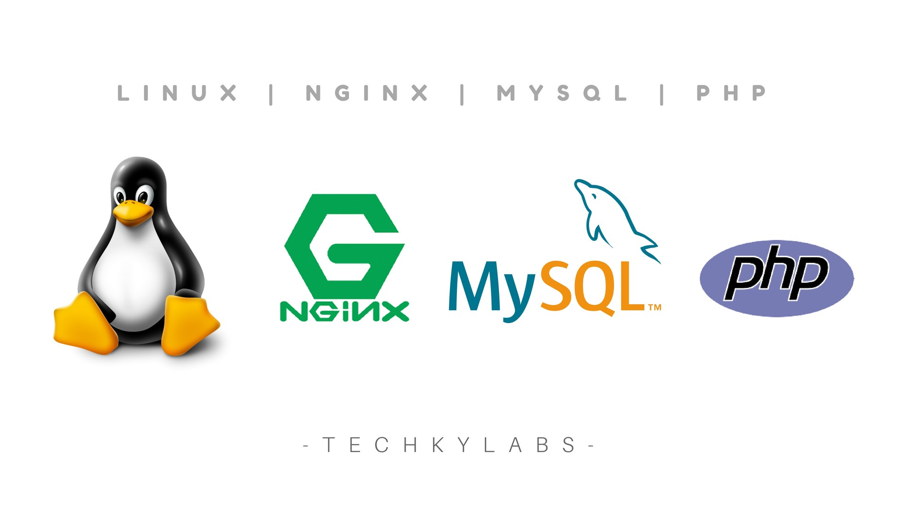
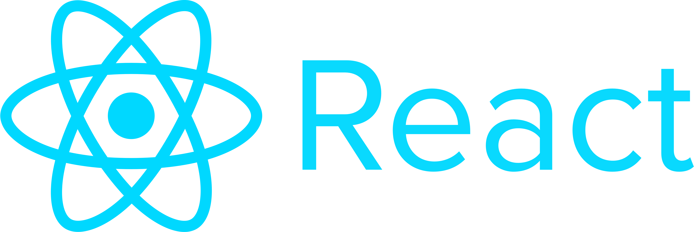

# PHP Challenge

Proyect developed using:
* [Testing Driven Development (TDD)](https://en.wikipedia.org/wiki/Test-driven_development) - Methodology.
* [Docker](https://www.docker.com/) - Virtualization.
* [Docker Compose](https://docs.docker.com/compose/) - Virtualization.
* [Linux, Nginx, MySQL and PHP (LEMP)](https://lemp.io/) - Stack.
* [Laravel](https://laravel.com/) - PHP Framework.
* [React JS](https://reactjs.org/) - JS Framework.


## Built With

</img>
</img>
</img>
</img>
</img>
</img>


## Online  web


* The project is available on:
[https://henrycvlemp01.herokuapp.com/](https://henrycvlemp01.herokuapp.com/)
## Examples

* Get all Posts
[https://henrycvlemp01.herokuapp.com/api/post](https://henrycvlemp01.herokuapp.com/api/post)

* Get all Tweets
[https://henrycvlemp01.herokuapp.com/api/twitter](https://henrycvlemp01.herokuapp.com/api/twitter)

## Getting Started

* Clone repo from 
[https://github.com/henrycv/henry_carbajal_challenge](https://github.com/henrycv/henry_carbajal_challenge)
  
* Run 
```
docker-compose up -d
```
Navigate to http://localhost to view app.

### Prerequisites

Install Docker and Docker Compose
## Contributing

Please read [CONTRIBUTING.md](https://gist.github.com/PurpleBooth/b24679402957c63ec426) for details on our code of conduct, and the process for submitting pull requests to us.

## Versioning

We use [SemVer](http://semver.org/) for versioning. For the versions available, see the [tags on this repository](https://github.com/your/project/tags). 

## Authors

* **Henry Carbajal** - [PurpleBooth](https://about.me/henrycv)

## License

This project is licensed under the MIT License - see the [LICENSE.md](LICENSE.md) file for details

## Acknowledgments

* Hat tip to anyone whose code was used
* Inspiration
* etc


## Docker steps
sudo rm -rf docker/mysql/data/*

echo "" >> ~/.bashrc && \
    echo 'export PATH="$HOME/.composer/vendor/bin:$PATH"' >> ~/.bashrc

export PATH="$HOME/.composer/vendor/bin:$PATH"

composer install --prefer-dist

npm install

npm run dev

## Laravel steps
php artisan migrate:reset

## Optional
#php artisan make:migration create_table_posts

php artisan make:model Post -m --force

php artisan make:model Tweet -m --force

php artisan migrate

php artisan make:factory PostFactory --model=Post

php artisan make:factory TweetFactory --model=Tweet

php artisan make:controller PostController -r

php artisan make:controller TwitterController -r

php artisan route:list

php artisan make:seeder UsersTableSeeder

php artisan make:seeder PostsTableSeeder

php artisan make:seeder TweetsTableSeeder

php artisan db:seed --class=UsersTableSeeder

php artisan db:seed --class=PostsTableSeeder

php artisan make:resource PostResource

php artisan make:resource TweetResource

## Not necessary
#php artisan make:resource Users --collection