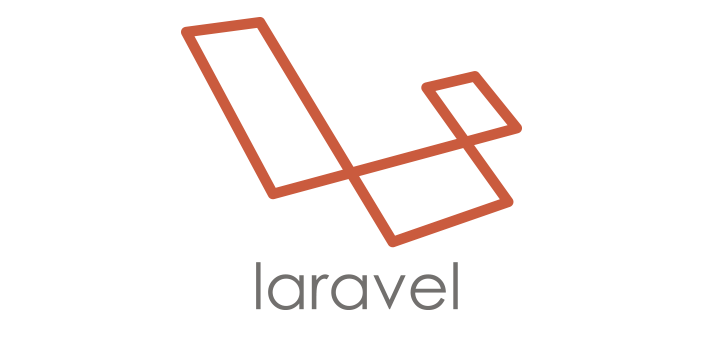

# PHP Challenge

Proyect developed using:
* [Testing Driven Development (TDD)](https://en.wikipedia.org/wiki/Test-driven_development) - Methodology.
* [Docker](https://www.docker.com/) - Virtualization.
* [Linux, Nginx, MySQL and PHP (LEMP)](https://lemp.io/) - Stack.
* [Laravel](https://laravel.com/) - PHP Framework.
* [React JS](https://reactjs.org//) - JS Framework.

</img>
</img>
</img>
</img>
</img>
## Getting Started

These instructions will get you a copy of the project up and running on your local machine for development and testing purposes. See deployment for notes on how to deploy the project on a live system.

### Prerequisites

What things you need to install the software and how to install them

```
Give examplesle
```

### Installing

A step by step series of examples that tell you how to get a development env running

Say what the step will be

```
Give the example
```

And repeat

```
until finished
```

End with an example of getting some data out of the system or using it for a little demo

## Running the tests

Explain how to run the automated tests for this system

### Break down into end to end tests

Explain what these tests test and why

```
Give an example
```

### And coding style tests

Explain what these tests test and why

```
Give an example
```

## Deployment

Add additional notes about how to deploy this on a live system

## Built With

* [Dropwizard](http://www.dropwizard.io/1.0.2/docs/) - The web framework used
* [Maven](https://maven.apache.org/) - Dependency Management
* [ROME](https://rometools.github.io/rome/) - Used to generate RSS Feeds

## Contributing

Please read [CONTRIBUTING.md](https://gist.github.com/PurpleBooth/b24679402957c63ec426) for details on our code of conduct, and the process for submitting pull requests to us.

## Versioning

We use [SemVer](http://semver.org/) for versioning. For the versions available, see the [tags on this repository](https://github.com/your/project/tags). 

## Authors

* **Billie Thompson** - *Initial work* - [PurpleBooth](https://github.com/PurpleBooth)

See also the list of [contributors](https://github.com/your/project/contributors) who participated in this project.

## License

This project is licensed under the MIT License - see the [LICENSE.md](LICENSE.md) file for details

## Acknowledgments

* Hat tip to anyone whose code was used
* Inspiration
* etc


## Docker steps
sudo rm -rf docker/mysql/data/*

echo "" >> ~/.bashrc && \
    echo 'export PATH="$HOME/.composer/vendor/bin:$PATH"' >> ~/.bashrc

export PATH="$HOME/.composer/vendor/bin:$PATH"

composer install --prefer-dist

npm install

npm run dev

## Laravel steps
php artisan migrate:reset

# Optional
#php artisan make:migration create_table_posts

php artisan make:model Post -m --force

php artisan make:model Tweet -m --force

php artisan migrate

php artisan make:factory PostFactory --model=Post

php artisan make:factory TweetFactory --model=Tweet

php artisan make:controller PostController -r

php artisan make:controller TwitterController -r

php artisan route:list

php artisan make:seeder UsersTableSeeder

php artisan make:seeder PostsTableSeeder

php artisan make:seeder TweetsTableSeeder

php artisan db:seed --class=UsersTableSeeder

php artisan db:seed --class=PostsTableSeeder

# Optional
#php artisan db:seed

php artisan make:resource PostResource

php artisan make:resource TweetResource

# Not necessary
#php artisan make:resource Users --collection